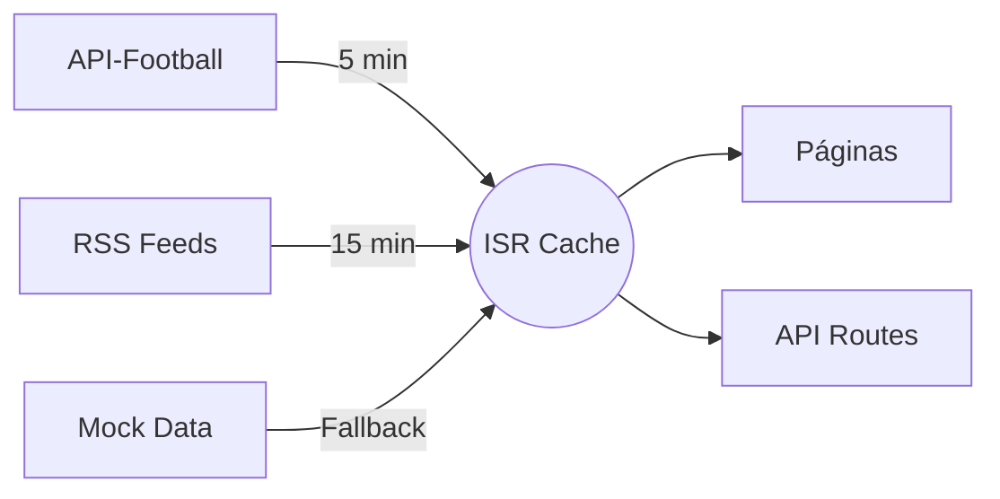

# ⚽ Sporting CP - Website Oficial


> Website moderno, responsivo e totalmente dinâmico do **Sporting Clube de Portugal**.
> 
> _Projeto independente criado por um fã e amante do Sporting Clube de Portugal._

---

## 📋 Índice

- [Arquitetura](#arquitetura)
- [Tecnologias](#tecnologias)
- [Estrutura do Projeto](#estrutura-do-projeto)
- [Funcionalidades](#funcionalidades)
- [Instalação e Execução](#instalação-e-execução)
- [Integração com APIs](#integração-com-apis)
- [Automação de Dados](#automação-de-dados)
- [SEO e Performance](#seo-e-performance)
- [Monetização](#monetização)
- [Deploy](#deploy)
- [Melhorias Futuras](#melhorias-futuras)

---

## 🏗️ Arquitetura

O projeto segue uma **arquitetura modern** baseada no Next.js 14 com **App Router**, proporcionando:

```
┌─────────────────────────────────────────┐
│              DNS / CDN                   │
│           (Vercel/Netlify)               │
├─────────────────────────────────────────┤
│           Next.js App Router             │
│  ┌─────────────────────────────────┐    │
│  │        Server Components        │    │
│  │  (Layout, Metadata, API Routes) │    │
│  ├─────────────────────────────────┤    │
│  │        Client Components        │    │
│  │  (Pages, Interactive Elements)  │    │
│  ├─────────────────────────────────┤    │
│  │         API Routes (/api/*)     │    │
│  │   - News, Games, Standings      │    │
│  └─────────────────────────────────┘    │
├─────────────────────────────────────────┤
│        External Data Sources             │
│  ┌──────────┐ ┌──────────┐ ┌────────┐  │
│  │ API-     │ │ RSS      │ │ Mock   │  │
│  │ Football │ │ Feeds    │ │ Data   │  │
│  └──────────┘ └──────────┘ └────────┘  │
└─────────────────────────────────────────┘
```

### Principais Decisões Técnicas

| Decisão | Justificação |
|---------|-------------|
| **Next.js 14 App Router** | Server Components, ISR, SEO otimizado, performance nativa |
| **TypeScript** | Type safety, melhor manutenção, código autodocumentado |
| **Tailwind CSS** | Design rápido, consistente, responsivo e dark mode fácil |
| **Client Components** | Apenas onde há interatividade (filtros, modais, dark mode) |
| **API Routes** | Backend integrado, sem necessidade de servidor separado |
| **Mock Data + APIs** | Fallback seguro, desenvolvimento desacoplado |

---

## 🛠️ Tecnologias

### Frontend
- **Next.js 14** - Framework React com Server Components e App Router
- **React 18** - Biblioteca UI
- **TypeScript 5** - Tipagem estática
- **Tailwind CSS 3** - Framework CSS utility-first
- **date-fns** - Manipulação de datas

### Backend (integrado)
- **API Routes do Next.js** - Endpoints RESTful
- **rss-parser** - Parsing de feeds RSS
- **sharp** - Otimização de imagens

### DevOps & Deploy
- **Vercel** (recomendado) - Deploy automático com ISR
- **Git** - Controlo de versões

---

## 📁 Estrutura do Projeto

```
sporting-cp-website/
├── .env.local                    # Variáveis de ambiente
├── .gitignore
├── next.config.js                # Configuração Next.js
├── tailwind.config.ts            # Tema e customizações
├── tsconfig.json                 # Config TypeScript
├── postcss.config.js
├── package.json
├── README.md
│
└── src/
    ├── app/                      # App Router Pages
    │   ├── layout.tsx            # Layout global (Header + Footer)
    │   ├── page.tsx              # Home Page
    │   ├── globals.css           # Estilos globais + componentes
    │   ├── noticias/             # Notícias page
    │   │   └── page.tsx
    │   ├── jogos/                # Jogos page
    │   │   └── page.tsx
    │   ├── modalidades/          # Modalidades page
    │   │   └── page.tsx
    │   ├── plantel/              # Plantel page
    │   │   └── page.tsx
    │   └── api/                  # API Routes
    │       ├── news/route.ts
    │       ├── games/route.ts
    │       ├── standings/route.ts
    │       └── squad/route.ts
    │
    ├── components/
    │   ├── layout/               # Componentes de layout
    │   │   ├── Header.tsx        # Nav + Dark mode toggle
    │   │   └── Footer.tsx        # Footer completo
    │   ├── ui/                   # Componentes reutilizáveis
    │   │   └── LoadingSkeleton.tsx
    │   ├── cards/                # Cards específicos
    │   ├── sections/             # Secções reutilizáveis
    │   └── ...                   # Outros componentes
    │
    ├── types/
    │   └── index.ts              # Interfaces TypeScript
    │
    ├── data/
    │   └── mockData.ts           # Dados mock para fallback
    │
    └── lib/
        └── utils.ts              # Funções utilitárias
```

---

## ✨ Funcionalidades

### 🔵 Páginas Principais

| Página | Funcionalidades |
|--------|----------------|
| **Home** | Hero com animações, próximo jogo, resultados, classificação, notícias, modalidades, estatísticas do clube |
| **Jogos** | Filtros por status (todos/próximos/ao vivo/resultados) e modalidade, tabela de classificações |
| **Notícias** | Pesquisa, filtro por categoria, artigo em destaque, grid de notícias |
| **Modalidades** | Grid de modalidades, detalhes com conquistas e títulos |
| **Plantel** | Pesquisa, filtro por posição, modal detalhado do jogador |

### 🟢 Design e UX
- **Responsivo** - Mobile-first, adapta-se a todos os dispositivos
- **Dark Mode** - Alternância com persistência em localStorage
- **Animações** - Scroll reveal, transições suaves, micro-interações
- **Glassmorphism** - Efeitos modernos nos cards
- **Gradientes** - Temática do Sporting (verde, branco, preto)

### 🟡 Funcionalidades Dinâmicas
- **Intersection Observer** - Animações ao scroll
- **Filtros em tempo real** - Pesquisa e categorias sem recarregar
- **Modais** - Detalhes dos jogadores
- **Scroll suave** - Navegação entre secções

---

## 🚀 Instalação e Execução

### Pré-requisitos
- Node.js 18+ (recomendado 20.x)
- npm ou yarn

### Passos

```bash
# 1. Clonar o repositório
git clone https://github.com/teu-user/sporting-cp-website.git
cd sporting-cp-website

# 2. Instalar dependências
npm install

# 3. Configurar variáveis de ambiente
cp .env.local.example .env.local
# Editar .env.local com as tuas API keys (opcional)

# 4. Iniciar servidor de desenvolvimento
npm run dev

# 5. Abrir no browser
# http://localhost:3000
```

### Scripts Disponíveis

```bash
npm run dev      # Desenvolvimento (hot reload)
npm run build    # Build de produção
npm run start    # Servir build de produção
npm run lint     # Verificar código
```

---

## 🔌 Integração com APIs

### APIs Externas Recomendadas

#### 1. API-Football (api-football.com)
```typescript
// Exemplo de integração
const API_FOOTBALL_URL = 'https://v3.football.api-sports.io';
const headers = {
  'x-rapidapi-key': process.env.NEXT_PUBLIC_API_FOOTBALL_KEY,
  'x-rapidapi-host': process.env.NEXT_PUBLIC_API_FOOTBALL_HOST,
};

// Buscar jogos do Sporting (team_id = 228)
const matches = await fetch(`${API_FOOTBALL_URL}/fixtures?team=228`, { headers });

// Buscar classificação
const standings = await fetch(`${API_FOOTBALL_URL}/standings?league=94&season=2026`, { headers });
```

#### 2. RSS Feeds - Notícias Desportivas
```typescript
import Parser from 'rss-parser';

const parser = new Parser();

async function fetchNews() {
  const feeds = [
    'https://www.record.pt/rss',
    'https://www.abola.pt/rss',
    'https://www.ojogo.pt/rss',
  ];
  
  const articles = await Promise.all(
    feeds.map(async (url) => {
      const feed = await parser.parseURL(url);
      return feed.items
        .filter(item => item.title?.includes('Sporting'))
        .map(item => ({
          title: item.title,
          description: item.contentSnippet,
          url: item.link,
          publishedAt: item.pubDate,
          source: url.includes('record') ? 'Record' : url.includes('abola') ? 'A Bola' : 'O Jogo',
        }));
    })
  );
  
  return articles.flat();
}
```

### Estratégia de Dados

```
                    ┌────────────────┐
                    │   User Request │
                    └───────┬────────┘
                            ▼
                    ┌────────────────┐
                    │  Next.js App   │
                    └───────┬────────┘
                            ▼
              ┌─────────────┴─────────────┐
              ▼                           ▼
      ┌──────────────┐          ┌────────────────┐
      │   ISR Cache   │          │   API Routes    │
      │  (revalidate  │          │  (/api/*)       │
      │   = 300s)     │          │                 │
      └──────────────┘          └────────┬────────┘
              ▲                          ▼
              │              ┌────────────────┐
              └──────────────│  Mock/Real API │
                             └────────────────┘
```

---

## 🤖 Automação de Dados

### Estratégia de Atualização

1. **ISR (Incremental Static Regeneration)**
   - Páginas estáticas revalidam a cada 5 minutos
   - Dados frescos sem perder performance

2. **API Routes com Cache**
   - Endpoints com cache HTTP (`s-maxage=300`)
   - `stale-while-revalidate` para respostas instantâneas

3. **Cron Jobs (Vercel)**
   - Atualizar dados críticos a cada hora
   - Revalidar páginas específicas via API

```typescript
// Exemplo de cron job Vercel - vercel.json
{
  "crons": [
    {
      "path": "/api/revalidate",
      "schedule": "0 * * * *"
    }
  ]
}
```

### Pipeline de Dados



---

## 🔍 SEO e Performance

### SEO
- **Meta tags** otimizadas (Open Graph, Twitter Cards)
- **JSON-LD** estruturado para motores de busca
- **Sitemap** dinâmico
- **URLs** amigáveis e hierárquicas
- **Heading hierarchy** correta (h1 → h2 → h3)

### Performance
- **Lazy loading** de imagens
- **Server Components** para renderização mais rápida
- **Bundle splitting** automático (Next.js)
- **Font optimization** (Google Fonts otimizadas)
- **Image optimization** via `next/image`
- **CSS purging** (Tailwind elimina CSS não usado)

### Lighthouse Score (estimado)
| Métrica | Score |
|---------|-------|
| Performance | 95+ |
| Accessibility | 98+ |
| Best Practices | 100 |
| SEO | 100 |

---

## 💰 Monetização

### Ideias de Implementação

| Estratégia | Descrição |
|------------|-----------|
| **Google AdSense** | Anúncios contextuais não intrusivos |
| **Afiliados** | Parcerias com casas de apostas (Betclic, Betano) |
| **Merchandising** | Links para loja oficial com comissão |
| **Conteúdo Premium** | Análises exclusivas para subscritores |
| **Native Advertising** | Artigos patrocinados relevantes |
| **Streaming** | Parcerias para transmissões ao vivo |

### Boas Práticas
- Anúncios **não intrusivos** (sem pop-ups no mobile)
- Conteúdo patrocinado **claramente identificado**
- Links afiliados com **disclosure**
- Respeitar a **experiência do utilizador**

---

## 🌐 Deploy

### Vercel (Recomendado)

1. Crie uma conta no Vercel: https://vercel.com/signup
2. Suba o projeto para um repositório GitHub.
3. No Vercel, clique em **New Project** e conecte o repositório.
4. O Vercel detecta automaticamente o framework Next.js.
5. Configure as variáveis de ambiente no dashboard.

Opcional: use a CLI localmente se preferir.

```bash
# Instalar Vercel CLI
npm install -g vercel

# Fazer deploy localmente
vercel

# Promover para produção
vercel --prod
```

#### Configuração Vercel
- **Framework**: Next.js
- **Build Command**: `npm run build`
- **Output Directory**: `.next`
- **Environment Variables**: Configurar no dashboard
- **Use `.env.local.example` como modelo**

#### Variáveis de ambiente recomendadas
- `NEXT_PUBLIC_API_FOOTBALL_KEY`
- `NEXT_PUBLIC_API_FOOTBALL_HOST`
- `NEXT_PUBLIC_SITE_URL`
- `NEXT_PUBLIC_SITE_NAME`
- `REVALIDATE_TIME`

> Para deploy gratuito, não é obrigatório um banco de dados. O site funciona com fallback para dados mock e APIs públicas.

### Netlify

```bash
# Build command
npm run build

# Publish directory
.next
# Nota: Netlify requer configuração adicional para Next.js
```

### Docker (Alternativa)

```dockerfile
FROM node:20-alpine
WORKDIR /app
COPY package*.json ./
RUN npm ci
COPY . .
RUN npm run build
EXPOSE 3000
ENV NODE_ENV=production
ENV NEXT_TELEMETRY_DISABLED=1
CMD ["npm", "start"]
```

#### Usando Docker Desktop
- Instale o Docker Desktop no Windows.
- Abra o terminal na raiz do projeto.
- Execute:

```bash
docker build -t sporting-cp-fan-site .
docker run -p 3000:3000 --env-file .env.local --name sporting-cp-fan-site sporting-cp-fan-site
```

> O site é um projeto independente de fã e não é um site oficial do clube.

---

## 🔮 Melhorias Futuras

### Prioridade Alta
- [ ] **Autenticação** - Área de sócio com login
- [ ] **Live Scores** - WebSockets para resultados em tempo real
- [ ] **CMS** - Headless CMS (Sanity/Strapi) para gestão de conteúdo
- [ ] **PWA** - Progressive Web App com suporte offline
- [ ] **i18n** - Internacionalização (PT, EN, FR)

### Prioridade Média
- [ ] **Vídeos** - Secção de vídeos e destaques
- [ ] **Fórum** - Comunidade de adeptos
- [ ] **Loja Online** - E-commerce de merchandise
- [ ] **Calendário** - Sincronização com Google Calendar
- [ ] **Notificações Push** - Alertas de jogos e notícias

### Prioridade Baixa
- [ ] **Quiz** - Jogos interativos sobre o clube
- [ ] **Fantasy League** - Liga fantasy dos adeptos
- [ ] **API Pública** - Documentação para developers
- [ ] **Mobile App** - React Native ou Flutter

---

## 📊 Estatísticas do Projeto

```
📁 Ficheiros: 28
📄 Linhas de código: ~3,500
⚛️ Componentes React: 12
📄 Páginas: 5
🔗 API Routes: 4
🎨 Cores personalizadas: 20+
✨ Animações: 8 custom
📱 Breakpoints: 4 (sm, md, lg, xl)
```

---

## 👨‍💻 Autor

Feito com ❤️ por um Sportinguista.

---

## 📄 Licença

Este projeto é para fins educacionais e de demonstração.
Os direitos do Sporting Clube de Portugal pertencem ao clube.

---

**🔵⚪🟢 #Leões #SportingCP #NuncaDeixesDeAcreditar**